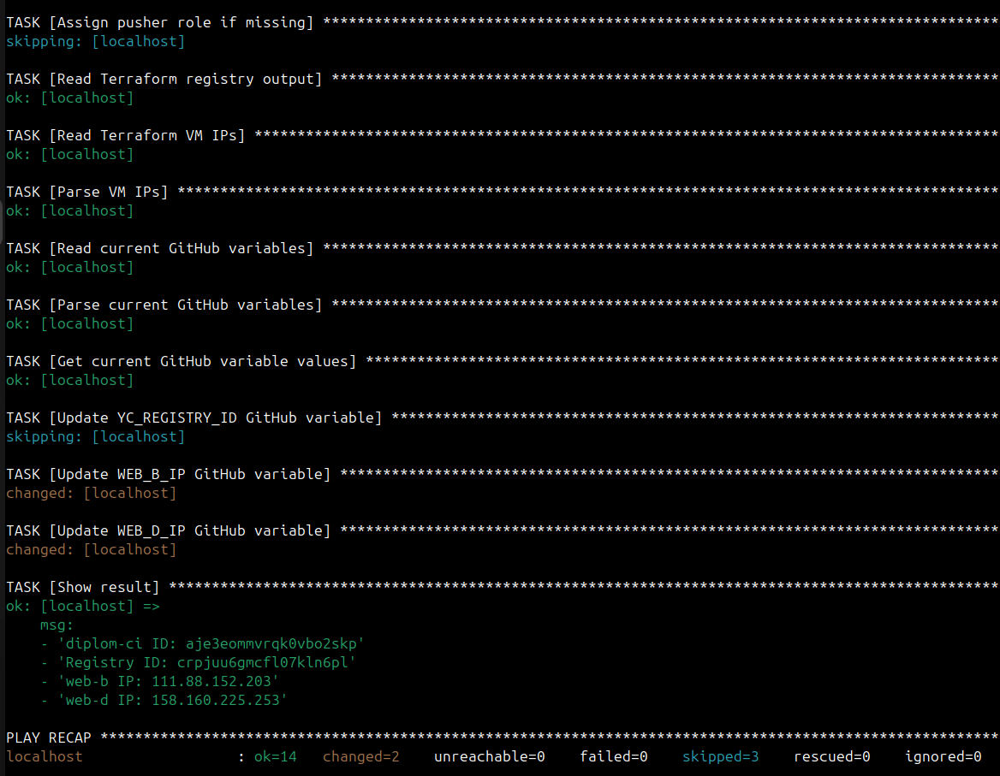
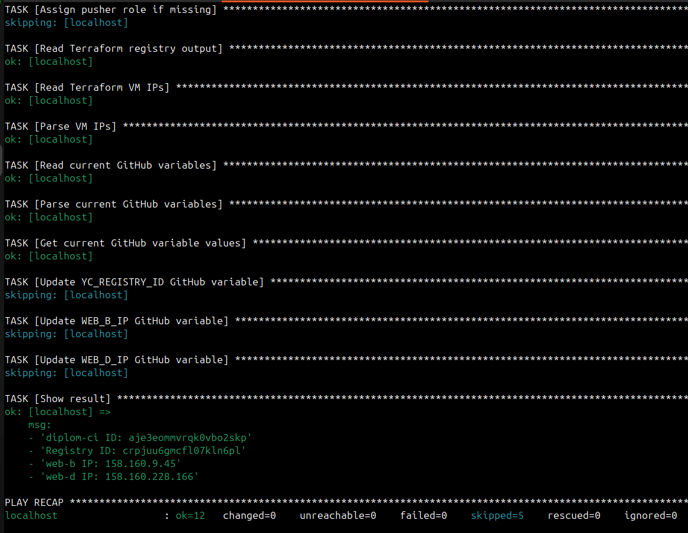

# Каталог ansible содержит playbook для первоначальной и повторной настройки CI-инфраструктуры проекта.

Ansible в этом проекте используется не для замены Docker-деплоя, а для автоматизации служебных операций:

    проверки необходимых CLI-инструментов;

    проверки и создания service account diplom-ci;

    проверки IAM-роли для публикации Docker image;

    чтения Terraform outputs;

    обновления GitHub Variables после пересоздания VM.

Обычный application deployment продолжает выполняться через GitHub Actions, SSH и Docker.

## Структура каталога
```
ansible/
    ├── ansible.cfg
    ├── bootstrap.yml
    ├── group_vars/
    │   └── all.yml
    ├── inventory/
    │   └── prod.yml
    └── README.md
```
## Назначение файлов:
Файл	                    Назначение
ansible.cfg	            Локальная конфигурация Ansible
bootstrap.yml	        Основной playbook bootstrap-процесса
inventory/prod.yml	    Inventory с локальным хостом
group_vars/all.yml	    Общие переменные playbook
README.md	            Документация Ansible-подсистемы


## В данном проекте Ansible запускается локально на Ubuntu-машине:
```
Ubuntu control machine
    ↓
Ansible
    ├── yc
    ├── terraform
    ├── gh
    └── jq
```
## Ansible не подключается к web-b и web-d по SSH в рамках bootstrap.yml.

Выполнение происходит на локальном control node через: connection: local

Ansible поддерживает явное описание localhost с ansible_connection=local, что позволяет выполнять команды непосредственно на управляющей машине.

## Файл ansible.cfg содержит настройки Ansible для данного проекта

## Файл inventory/prod.yml описывает хост, на котором выполняется playbook

## Файл group_vars/all.yml содержит переменные, доступные всем хостам и задачам playbook

## Файл bootstrap.yml — основной Ansible playbook проекта.

Полный порядок выполнения Ansible:
```
ansible-playbook bootstrap.yml
        ↓
Проверка yc, terraform, gh, jq
        ↓
Проверка diplom-ci
        ↓
Создание diplom-ci при отсутствии
        ↓
Получение ID diplom-ci
        ↓
Проверка IAM role pusher
        ↓
Назначение роли при отсутствии
        ↓
Чтение Terraform Registry ID
        ↓
Чтение IP web-b и web-d
        ↓
Чтение текущих GitHub Variables
        ↓
Сравнение значений
        ↓
Обновление только изменившихся Variables
        ↓
Вывод результата
```
При повторном запуске Ansible не создаёт уже существующие ресурсы и не обновляет GitHub Variables без необходимости. Это делает playbook удобным для повторного использования после пересоздания инфраструктуры. Ansible определяет принцип идемпотентности как повторное выполнение операции без изменения итогового состояния:

### После первого Terraform apply

cd ~/diplom/terraform
terraform apply

cd ~/diplom/ansible
ansible-playbook bootstrap.yml



### После пересоздания VM

cd ~/diplom/terraform
terraform destroy
terraform apply

cd ~/diplom/ansible
ansible-playbook bootstrap.yml

